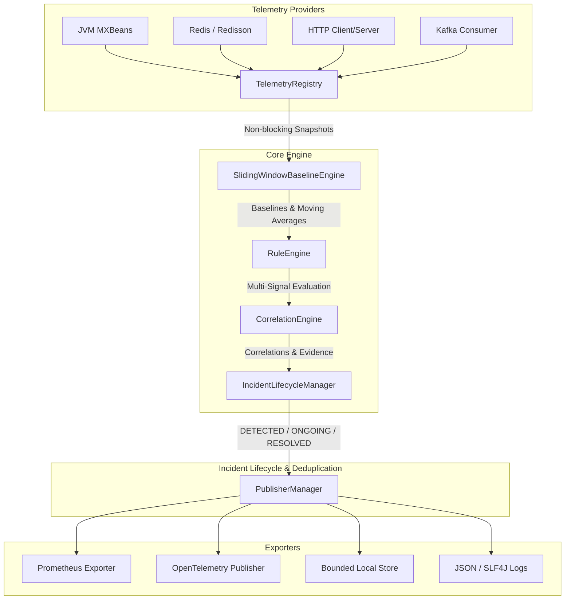

# Incident Pattern Detector

[](https://oracle.com/java/)
[](LICENSE)
[]()

> **Incident Pattern Detector** is a lightweight, local-first, plug-and-play Java library that detects production failure patterns from application telemetry and produces **explainable, evidence-backed observations**.

---

## 🚀 Key Capabilities

- **Beyond Raw Metrics**: Rather than publishing isolated alerts (`redis_pool_utilization = 98%`), it correlates metrics to emit structured `IncidentObservation` objects explaining **Pattern**, **Severity**, **Confidence**, **Evidence**, **Correlations**, **Probable Causes**, **Impacts**, and **Recommended Actions**.
- **Local-First & Deterministic**: Zero cloud dependencies, zero external AI calls, zero external database requirements. Runs entirely inside your JVM process.
- **Lightweight & Non-Blocking**: Asynchronous background evaluation, zero overhead on application request paths, lock-free telemetry ingestion, and bounded sliding memory windows.
- **Microservices Deployment Guide**: See [Microservices Guide](docs/MICROSERVICES_GUIDE.md) for deploying across distributed microservice fleets, Kubernetes, and Grafana alert setup.
- **10 Out-of-the-Box Incident Detectors**:
  - `POOL_SATURATION`
  - `RETRY_STORM`
  - `TIMEOUT_CASCADE`
  - `HOT_KEY` (with automatic SHA-256 key masking)
  - `CACHE_THRASHING`
  - `THREAD_POOL_STARVATION` (multi-signal guarded)
  - `CONSUMER_LAG`
  - `LARGE_PAYLOAD` (metadata-only)
  - `GC_LATENCY` (STW pause correlation)
  - `DEPENDENCY_DEGRADATION`
- **Incident Lifecycle Management**: Tracks state transitions (`DETECTED` -> `ONGOING` -> `RESOLVED`), suppresses duplicate noise with hysteresis & cooldowns, and generates resolution observations showing before/after metric recovery.
- **Multi-Destination Publishing**: Prometheus, OpenTelemetry, JSON logs, bounded local memory storage, and custom publishers.
- **Spring Boot 3 Starter**: Zero-config auto-wiring with Actuator endpoint integration (`/actuator/incident-detector`).

---

## 🏛️ Architecture & Component Design



---

## 📦 Quick Start

### 1. Add Maven Dependency

```xml
<dependency>
    <groupId>io.github.incidentdetector</groupId>
    <artifactId>incident-detector-spring-boot-starter</artifactId>
    <version>1.0.0-SNAPSHOT</version>
</dependency>
```

### 2. Spring Boot Setup (`application.yml`)

```yaml
incident-detector:
  enabled: true
  evaluation-interval: 10s
  baseline-window: 15m
  cooldown-window: 30s
  publishers:
    prometheus:
      enabled: true
    opentelemetry:
      enabled: true
    storage:
      enabled: true
```

### 3. Core Java API (Standalone Mode)

```java
IncidentDetector detector = IncidentDetector.builder()
    .evaluationInterval(Duration.ofSeconds(10))
    .baselineWindow(Duration.ofMinutes(15))
    .cooldownWindow(Duration.ofSeconds(30))
    .registerRule(new PoolSaturationRule())
    .registerRule(new HotKeyRule())
    .registerPublisher(new PrometheusObservationPublisher())
    .build();

detector.start();
```

---

## 📊 Example Explainable Observation

When Redis pool saturation occurs, the library produces a structured observation:

```text
Pattern: POOL_SATURATION
State: DETECTED
Severity: CRITICAL
Confidence: 94%

Summary:
Connection pool saturation detected: pool utilization elevated with pending acquisitions.

Evidence:
- pool.utilization = 98% (baseline: 40%, threshold: 90%, direction: ELEVATED, contribution: 35%)
- pool.pending_acquisitions = 43 requests (baseline: 0, threshold: 5, direction: SPIKE, contribution: 25%)
- pool.acquire_latency_p95 = 740ms (baseline: 15ms, threshold: 45ms, direction: INCREASE, contribution: 25%)
- request.latency_p95 = 920ms (baseline: 50ms, threshold: 100ms, direction: INCREASE, contribution: 15%)

Correlations:
- pool.acquire_latency_p95 -> request.latency_p95 (lag: 500ms, strength: 0.92): Connection acquisition latency increased prior to application request latency spike.

Probable Causes:
- Connection pool contention due to insufficient pool size.
- Slow downstream database or Redis operations holding connections.
- Connection leak caused by unclosed resources.

Potential Impacts:
- Incoming requests are queued waiting for connections, dramatically elevating API response latency.
- Risk of connection acquisition timeouts leading to HTTP 500 errors.

Recommended Actions:
- Check downstream dependency execution latency.
- Inspect connection pool max size and active connection counts.
- Verify connections are properly closed after query execution.
- Monitor request concurrency rates.
```

---

## 🔒 Security & Privacy

- **Raw Key Masking**: The `HotKeyRule` automatically computes a SHA-256 hash (`sha256:a1b2c3d4e5f6`) of Redis/Cache keys to prevent leaking user tokens or PII into logs/metrics.
- **Payload Privacy**: `LargePayloadRule` strictly measures byte counts and serialization latencies; raw request/response bodies are **never** inspected or retained.
- **Low Cardinality**: Prometheus labels are sanitized to enforce bounded metric cardinality.

---

## 📈 Benchmark & Overhead

Rule evaluation overhead measured using 100,000 iterations on Java 21:
- **Average Rule Evaluation Latency**: `< 0.005 ms` (less than 5 microseconds)
- **Telemetry Ingestion Overhead**: Non-blocking atomic updates (`< 20 ns`)
- **Memory Footprint**: Bounded sliding window queues (configurable, default 1,000 snapshots)

---

## 📄 License

Apache License 2.0. See [LICENSE](LICENSE) for details.
