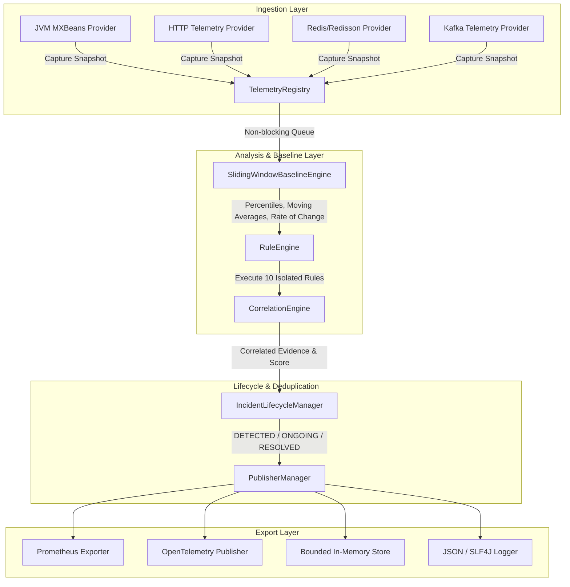

# Incident Pattern Detector - Architecture & Design Specifications

## 1. Overview

The **Incident Pattern Detector** is designed as a local-first, lightweight, embeddable Java observability component. It sits within the application process, consuming metrics asynchronously from application frameworks, JVM MXBeans, HTTP clients, message consumers, and database/Redis connection pools, and converting raw telemetry into explainable, evidence-backed `IncidentObservation` objects.

---

## 2. Core Components

### 2.1 TelemetryRegistry
- Collects `TelemetrySnapshot` metrics from registered `TelemetryProvider`s and direct application calls.
- Enforces thread safety using `ConcurrentHashMap` and lock-free atomic counters.

### 2.2 SlidingWindowBaselineEngine
- Maintains circular deque buffers of historical snapshots for up to 15 minutes (configurable).
- Computes statistical baselines:
  - **Moving Average**: \(\bar{x} = \frac{1}{N} \sum_{i=1}^{N} x_i\)
  - **Percentiles**: p50, p95, p99 calculated over sliding window intervals.
  - **Rate of Change**: \(\Delta = \frac{x_{now} - x_{baseline}}{|x_{baseline}|}\)
  - **Standard Deviation**: \(\sigma = \sqrt{\frac{\sum (x_i - \bar{x})^2}{N}}\)

### 2.3 RuleEngine
- Evaluates 10 out-of-the-box incident pattern rules.
- **Failure Isolation**: Executes each rule in an isolated `try-catch` block. If `Rule A` throws an exception, `Rule B`, `Rule C`, and `Rule D` continue evaluating unaffected.

### 2.4 CorrelationEngine
- Discovers temporal lead-lag relationships across signals.
- Computes lagged cross-correlation over sliding time windows:
  \[
  r_{xy}(k) = \frac{\sum (x_i - \bar{x})(y_{i+k} - \bar{y})}{\sqrt{\sum (x_i - \bar{x})^2 \sum (y_i - \bar{y})^2}}
  \]
- Identifies signal propagation (e.g., connection acquisition latency spiking prior to application request latency spike).

### 2.5 IncidentLifecycleManager & Deduplication
- Tracks active incidents in a `ConcurrentHashMap` using fingerprint keys: `pattern:dimensions`.
- State Machine:
  - `DETECTED`: Initial pattern trigger. Emits observation immediately.
  - `ONGOING`: Sustained pattern trigger. Suppressed by default during cooldown windows (e.g., 30s) unless severity escalates.
  - `RESOLVED`: Emitted when conditions return to normal thresholds. Contains before/after comparative metric recovery evidence.

### 2.6 PublisherManager
- Publishes generated observations to registered `ObservationPublisher` implementations.
- Isolates publisher exceptions (a failure in Prometheus export does not impact OpenTelemetry or local storage).

---

## 3. Performance & Memory Safety

- **Zero Blocking**: Telemetry recording and rule evaluations are non-blocking on application request threads.
- **Bounded Memory**: Circular queues cap historical snapshot memory footprint (default 1,000 snapshots max).
- **Sub-Millisecond Overhead**: Average rule evaluation latency is `< 0.005 ms` (5 microseconds).
