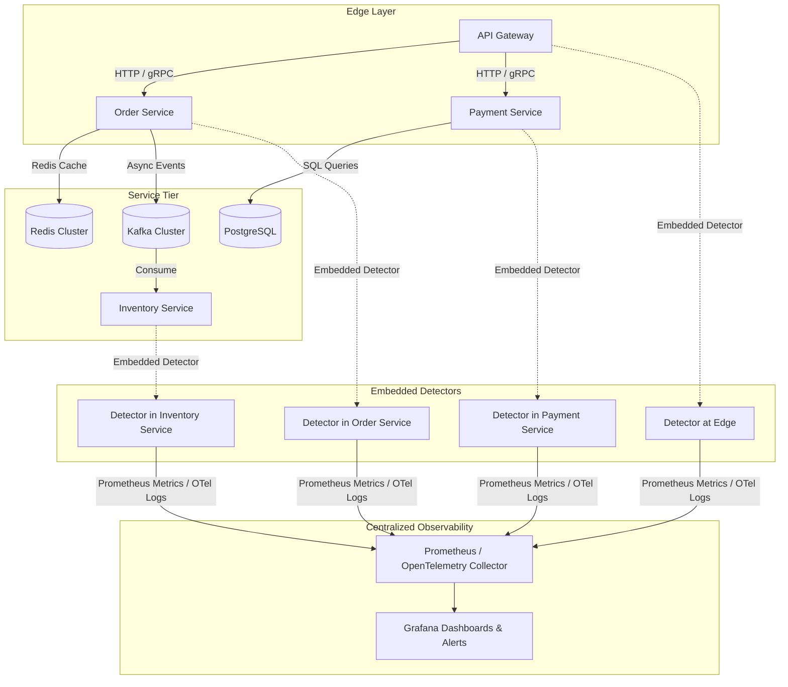

# Microservices Architecture Deployment Guide

This guide explains how to deploy **Incident Pattern Detector** across a distributed microservice fleet.

---

## 🏛️ Microservice Deployment Topology

In a microservice architecture, **Incident Pattern Detector** acts as an **embedded local-first observability engine** running inside each microservice instance, combined with centralized aggregation via Prometheus / OpenTelemetry / Grafana.



---

## 🛠️ Step-by-Step Setup

### Step 1: Add Dependency to Common Microservice Parent or Starter

Add `incident-detector-spring-boot-starter` to your microservice shared parent POM or BOM:

```xml
<dependency>
    <groupId>io.github.incidentdetector</groupId>
    <artifactId>incident-detector-spring-boot-starter</artifactId>
    <version>1.0.0-SNAPSHOT</version>
</dependency>
```

---

### Step 2: Configure Service Dimensions & Profiles

In each microservice's `application.yml`, set the service component name so observations are correctly attributed in Grafana/Prometheus:

```yaml
spring:
  application:
    name: order-service

incident-detector:
  enabled: true
  evaluation-interval: 10s
  baseline-window: 15m
  cooldown-window: 30s
  publishers:
    prometheus:
      enabled: true
    opentelemetry:
      enabled: true
    storage:
      enabled: true

# Expose Actuator endpoints for Prometheus & Incident Detector
management:
  endpoints:
    web:
      exposure:
        include: health, prometheus, incident-detector
```

---

### Step 3: Targeted Detector Setup by Service Role

Different microservice roles benefit from specific detectors:

| Microservice Role | Recommended Active Detectors | Primary Signals |
| :--- | :--- | :--- |
| **API Gateway / Edge** | `TIMEOUT_CASCADE`, `RETRY_STORM`, `LARGE_PAYLOAD` | Gateway request latency, HTTP status code 504s, payload size metadata |
| **Domain Services** *(Order, Payment)* | `POOL_SATURATION`, `DEPENDENCY_DEGRADATION`, `THREAD_POOL_STARVATION`, `GC_LATENCY` | DB/Redis pool acquire latencies, executor queue depths, STW GC pauses |
| **Caching Layer** *(User, Catalog)* | `HOT_KEY`, `CACHE_THRASHING` | Redis key access distribution (SHA-256 masked), hit/miss ratios, eviction rates |
| **Event Workers** *(Notification, Analytics)* | `CONSUMER_LAG` | Kafka consumer lag growth rate, partition imbalance, record processing latency |

---

### Step 4: Distributed Cascade Correlation (`TIMEOUT_CASCADE`)

When an incident cascades across microservices (e.g. `Payment Service` DB slowdown $\rightarrow$ `Payment Service` timeout $\rightarrow$ `Order Service` retry storm $\rightarrow$ `API Gateway` 504 gateway timeout):

1. **Local Detection**: `Payment Service`'s embedded detector triggers `POOL_SATURATION`.
2. **Upstream Detection**: `Order Service`'s embedded detector triggers `RETRY_STORM` and `DEPENDENCY_DEGRADATION`.
3. **Edge Detection**: `API Gateway`'s embedded detector triggers `TIMEOUT_CASCADE`.
4. **Centralized Correlation**: Prometheus / OpenTelemetry aggregates `incident_pattern_detected{service="..."}` metrics across the entire service graph.

---

### Step 5: Kubernetes / Helm Fleet Deployment

Configure global environment variables in your Kubernetes deployment templates / Helm charts:

```yaml
env:
  - name: INCIDENT_DETECTOR_ENABLED
    value: "true"
  - name: INCIDENT_DETECTOR_EVALUATION_INTERVAL
    value: "10s"
  - name: INCIDENT_DETECTOR_PUBLISHERS_PROMETHEUS_ENABLED
    value: "true"
```

---

## 📊 Centralized Grafana & Prometheus Alerting

### Prometheus Alert Rule Example

```yaml
groups:
  - name: incident_detector_alerts
    rules:
      - alert: CriticalProductionPatternDetected
        expr: incident_pattern_detected{severity="CRITICAL"} == 1
        for: 30s
        labels:
          severity: critical
        annotations:
          summary: "Critical failure pattern {{ $labels.pattern }} detected in {{ $labels.component }}"
          description: "Confidence: {{ $labels.confidence }}. Inspect /actuator/incident-detector on the service instance."
```
